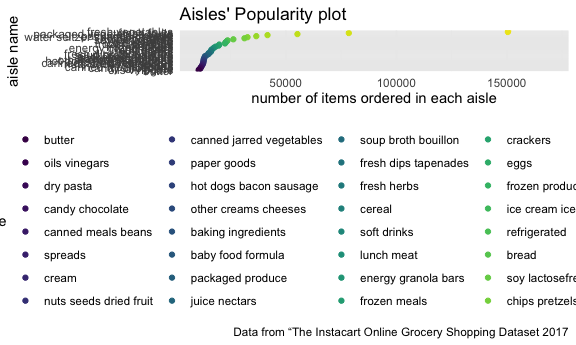

p8105\_hw3\_cm4070
================

``` r
library(tidyverse)
```

    ## ── Attaching packages ─────────────────────────────────────── tidyverse 1.3.1 ──

    ## ✓ ggplot2 3.3.5     ✓ purrr   0.3.4
    ## ✓ tibble  3.1.4     ✓ dplyr   1.0.7
    ## ✓ tidyr   1.1.3     ✓ stringr 1.4.0
    ## ✓ readr   2.0.1     ✓ forcats 0.5.1

    ## ── Conflicts ────────────────────────────────────────── tidyverse_conflicts() ──
    ## x dplyr::filter() masks stats::filter()
    ## x dplyr::lag()    masks stats::lag()

``` r
library(patchwork)

knitr::opts_chunk$set(
  fig.width = 6,
  fig.asp = .6, 
  out.width = "90%"
)

theme_set(theme_minimal() + theme(legend.position = "bottom"))

options( 
  ggplot2.continuous.colour = "viridis", 
  ggplot2.continuous.fill = "viridis"
)

scale_colour_discrete = scale_color_viridis_d
scale_fill_discrete = scale_fill_viridis_d
```

## Question 1

### Load data

``` r
library(p8105.datasets)

data("instacart") 
```

There are 1384617 observations and 15 variables, and key variable names
are order\_id, product\_id, add\_to\_cart\_order, reordered, user\_id,
eval\_set, order\_number, order\_dow, order\_hour\_of\_day,
days\_since\_prior\_order, product\_name, aisle\_id, department\_id,
aisle, department in the `instacart` data.

### Describe aisles with plot

``` r
instacart %>% 
  count(aisle, name = "n_columns") %>% 
  arrange(desc(n_columns)) %>% 
  filter(n_columns > 10000) %>% 
  mutate(aisle = forcats::fct_reorder(aisle, n_columns)) %>% 
  ggplot(aes(x = n_columns, y = aisle, color = aisle)) + geom_point() +
  labs(title = "Aisles' Popularity plot", 
    x = "number of items ordered in each aisle",
    y = "aisle name",
    caption = "Data from “The Instacart Online Grocery Shopping Dataset 2017"
    ) +
    scale_x_continuous(
      limits = c(10000, 170000))
```



There are approximately 134 aisles. The aisles most ordered from are
fresh vegetables, fresh fruits, and packaged vegetables and fruits. We
can see this in the above plot where we see the number of items ordered
in each aisle with its respective name and the values at approximately
150000 values are those most popular.

### Make a table with three most popular items within 3 aisles

``` r
popular_items =
  instacart %>%
  group_by(aisle, product_name) %>% 
  filter(aisle %in% c("baking ingredients", "dog food care", "packaged vegetables fruits")) %>%
  summarize(n_obs = n()) %>%
  arrange(desc(n_obs)) %>%
  slice(1:3) %>%
  knitr::kable(digits = 1)
```

    ## `summarise()` has grouped output by 'aisle'. You can override using the `.groups` argument.

``` r
popular_items
```

| aisle                      | product\_name                                 | n\_obs |
|:---------------------------|:----------------------------------------------|-------:|
| baking ingredients         | Light Brown Sugar                             |    499 |
| baking ingredients         | Pure Baking Soda                              |    387 |
| baking ingredients         | Cane Sugar                                    |    336 |
| dog food care              | Snack Sticks Chicken & Rice Recipe Dog Treats |     30 |
| dog food care              | Organix Chicken & Brown Rice Recipe           |     28 |
| dog food care              | Small Dog Biscuits                            |     26 |
| packaged vegetables fruits | Organic Baby Spinach                          |   9784 |
| packaged vegetables fruits | Organic Raspberries                           |   5546 |
| packaged vegetables fruits | Organic Blueberries                           |   4966 |

This table shows the top 3 most ordered products within baking
ingredients, dog food care, and packaged vegetable fruits aisles, and
number of times they were ordered.

### Mean hour table - Pink Lady Apples and Coffee Ice Cream

``` r
instacart %>%
  select(product_name, order_dow, order_hour_of_day) %>%
  filter(product_name == "Pink Lady Apples" | product_name == "Coffee Ice Cream") %>%
  group_by(product_name, order_dow) %>%
  summarize(
    mean_hour_of_day = mean(order_hour_of_day)) %>%
  mutate(order_dow = 
           recode(order_dow,
                  "0" = "monday", "1" = "tuesday","2" = "wednesday", "3" = "thursday", "4" = "friday", "5" = "saturday","6" = "sunday")) %>%
    pivot_wider(
    names_from = order_dow,
    values_from = mean_hour_of_day) %>%
    knitr::kable(digits = 1)
```

    ## `summarise()` has grouped output by 'product_name'. You can override using the `.groups` argument.

| product\_name    | monday | tuesday | wednesday | thursday | friday | saturday | sunday |
|:-----------------|-------:|--------:|----------:|---------:|-------:|---------:|-------:|
| Coffee Ice Cream |   13.8 |    14.3 |      15.4 |     15.3 |   15.2 |     12.3 |   13.8 |
| Pink Lady Apples |   13.4 |    11.4 |      11.7 |     14.2 |   11.6 |     12.8 |   11.9 |

This table shows the mean hour of the day at which Pink Lady Apples and
Coffee Ice Cream are ordered on each day of the week.

## Question 2

### Clean the BRFSS Data set

``` r
brfss_df = 
  brfss_smart2010 %>% 
  janitor::clean_names() %>% 
  filter(topic %in% "Overall Health" & response %in% c("Excellent", "Very good", "Good", "Fair", "Poor")) %>% 
  mutate(response = forcats::fct_relevel(response, c("Poor", "Fair", "Good", "Very good", "Excellent"))
  )
```
